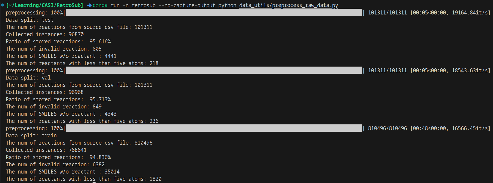

## 第0步：数据处理

下载USPTO_full的数据，数据集包括三个raw_{$}，$为train，test，val。生成对应的三组文件idx-{$}，src-{$}，tgt-{$}。

- tgt为反应物文件
- src为产物文件
- idx为索引标签文件

以下是处理结果



## 第一步：反应检索

基于Neural Machine Translation with Monolingual Translation Memory这篇论文的NMT（Neural Machine Translation）神经机器翻译模型。


检索模型使用了一个简单的双编码器模型，这样，最相关的语句就可以简化为最大内积搜索（MIPS）。

相关性评分：


x经过Transformer，W是线性投影，最后进行归一化（[-1，1]之间）输出为E(x)。

在实际应用中，TM（Translation Memory）中所有句子的稠密表示（E(x)）可以使用**FAISS**进行预先计算和索引，**FAISS** 是一个用于高效向量搜索的开源工具包。

#### 准备数据

首先制作训练数据，将src-train和tgt-train整合进**train.txt**中，然后创建src-train和tgt-train的字典src.vocab,tgt.vocab。然后将src-val，tgt-val整合进**val.txt**中，src-test，tgt-test整合进**test.txt**中。（每行的前一个是产物，后一个反应物）

#### 训练检索模型

训练上述的双端编码器检索模型，用于检索与输入产物相似的反应物

#### 建立反应检索搜索索引

将tgt-train和tgt-val整合成candidates.txt集合文件，去掉两者中的重复项。生成所有反应物的候选集。

利用训练好的模型以及候选集candidates数据，使用最大内积搜索（MIPS）建立索引，并保存为**mips_index文件**，并将处理后特征向量的文件保存为**feat.pt文件**。

搜索索引，将上述train，val，test三个文件每行都进行搜索20个最近关系的项，并另外存储为.top20.txt文件。然后对top20文件进行处理，变为如何格式的列表文件，cans的第一个参数是候选反应物，第二个参数是得分。

```python
item = {'id': count,
                'src': src,
                'tgt': tgt,
                'cans': [(can, score) for can, score in zip(candidates,scores)]
        }
```

## 第二步：子结构提取

#### 建立从反应物到产物的字典

将train和val的数据整合，建立从反应物到产物的字典：**reaction.pkl**，从产物到反应物的字典：**reaction_s2t.pkl**。

#### 在USPTO_full的数据上做子结构提取

根据分子指纹，首先获取目标分子中被公共指纹覆盖的原子索引，然后从目标分子和查询分子中提取子结构和片段，并给它们添加同位素标记。每次做一个chunk，一共有200个chunk，每次都生成训练数据，最后将200个训练数据整合在一起。

```python
def get_sub_mol(mol, atom_idx): #从输入的分子中提取子结构和片段，并给它们添加同位素标记
    """Get substruture and fragments with isotopic label

        Args:
        mol (Mol): rdkit.Chem.rdchem.Mol of the query molecule
        atom_idx (dict): atom index

    Returns:
        tuple: (substruture, substruture with isotopic label, fragments with isotopic label)            
    """
    # 给原子添加同位素标签
    sub_atom_idx, labeled_mol = label_mol(mol, atom_idx)
    # 将分子分割成子结构和片段
    labeled_sub, labeled_frag = split_mol(labeled_mol, sub_atom_idx)
    # 返回去掉同位素标签的子结构，同位素标记的子结构和片段，以及标记的分子
    return remove_isotope(labeled_sub), labeled_sub, labeled_frag, labeled_mol

def label_mol(mol, atom_idx, is_remove_multi2multi=False):
    """为子结构中的原子添加同位素标签

    Args:
        mol (Mol): 输入分子
        atom_idx (set(int)): 子结构中的原子索引集合
        is_remove_multi2multi (bool, optional): 是否移除多对多的情况。如果为True，不添加同位素标签，
            而是返回将带有多个同位素编号的原子的列表。默认为False。

    Returns:
        labeled molecule
    """

    mol_rw = Chem.RWMol(mol)  # 将分子转换为可编辑的RWMol对象
    break_bond_atom = defaultdict(set)  # 存储断键邻居的字典

    # 找到子结构中的原子，并标记它们的断键邻居
    for i in atom_idx:
        atom = mol_rw.GetAtomWithIdx(i)  # 获取原子对象
        for x in atom.GetNeighbors():  # 遍历邻居原子
            _idx = x.GetIdx()  # 获取邻居原子的索引
            if _idx not in atom_idx:  # 如果邻居原子不在子结构中
                break_bond_atom[i].add(_idx)  # 将邻居原子添加到断键邻居中

    isotopic_mark = 1  # 同位素标签初始值
    marked_atoms = {}  # 存储已标记的原子字典
    act_atoms = copy.deepcopy(break_bond_atom)  # 活跃原子字典的深拷贝

    # 遍历断键邻居，为子结构中的原子添加同位素标签
    while act_atoms:
        sub_atom_idx, frag_atom_idx = act_atoms.popitem()  # 弹出一个子结构原子及其断键邻居集合

        for cur_atom_idx in frag_atom_idx:  # 遍历断键邻居
            sub_atom = mol_rw.GetAtomWithIdx(sub_atom_idx)  # 获取子结构原子对象
            frag_atom = mol_rw.GetAtomWithIdx(cur_atom_idx)  # 获取断键邻居原子对象

            cur_bond_type = str(mol_rw.GetBondBetweenAtoms(  # 获取两原子间的键类型
                sub_atom_idx, cur_atom_idx).GetBondType())
            cur_chiral_tag = str(sub_atom.GetChiralTag())  # 获取子结构原子的手性标记

            if cur_atom_idx not in marked_atoms:  # 如果邻居原子未标记
                frag_atom.SetIsotope(isotopic_mark)  # 为断键邻居原子添加同位素标签
                sub_atom.SetIsotope(isotopic_mark)  # 为子结构原子添加同位素标签

                sub_atom.SetProp(PropNames.Bond_Type, cur_bond_type)  # 设置子结构原子的键类型属性
                sub_atom.SetProp(PropNames.Chiral_Tag, cur_chiral_tag)  # 设置子结构原子的手性标记属性

                if is_remove_multi2multi and sub_atom_idx in marked_atoms:
                    # 如果要移除多对多的情况，且子结构原子已经标记，则返回子结构原子索引
                    return sub_atom_idx

                assert sub_atom_idx not in marked_atoms
                marked_atoms[cur_atom_idx] = isotopic_mark  # 记录已标记的原子
                marked_atoms[sub_atom_idx] = isotopic_mark  # 记录已标记的原子
                isotopic_mark += 1  # 同位素标签加1
            else:  # 如果邻居原子已经标记
                cur_mark = marked_atoms[cur_atom_idx]  # 获取已标记的同位素标签
                sub_atom.SetIsotope(cur_mark)  # 为子结构原子添加同位素标签
                sub_atom.SetProp(PropNames.Bond_Type, cur_bond_type)  # 设置子结构原子的键类型属性
                sub_atom.SetProp(PropNames.Chiral_Tag, cur_chiral_tag)  # 设置子结构原子的手性标记属性

                if is_remove_multi2multi and sub_atom_idx in marked_atoms:
                    # 如果要移除多对多的情况，且子结构原子已经标记，则返回子结构原子索引
                    return sub_atom_idx

                assert sub_atom_idx not in marked_atoms
                marked_atoms[sub_atom_idx] = cur_mark  # 记录已标记的原子

    if is_remove_multi2multi:
        # 如果没有需要移除的原子，则返回None
        return None
    return atom_idx, mol_rw  # 返回标记后的原子索引集合和分子对象

def split_mol(mol, atom_idx):
    """将分子分割成子结构和片段

    Args:
        mol (Mol): 输入分子
        atom_idx (set(int)): 子结构中的原子索引集合

    Returns:
        Tuple: 带同位素标签的子结构和片段分子
    """
    sub_mol, frag_mol = Chem.RWMol(mol), Chem.RWMol(mol)  # 创建分子的可编辑副本

    atom_num = 0
    for _ in mol.GetAtoms():
        atom_num += 1

    # 为子结构和片段添加氢原子
    for idx in range(atom_num - 1, -1, -1):
        if idx in atom_idx:  # 如果原子在子结构中
            atom_to_remove = frag_mol.GetAtomWithIdx(idx)  # 获取需要移除的原子对象
            atom_id2num_add_H = {}

            for neighbor_atom in atom_to_remove.GetNeighbors():  # 遍历原子的邻居原子
                neighbor_atom_id = neighbor_atom.GetIdx()  # 获取邻居原子的索引
                if neighbor_atom_id not in atom_idx and need_to_add_Hs(frag_mol.GetAtomWithIdx(neighbor_atom_id)):
                    # 如果邻居原子不在子结构中，并且需要添加氢原子
                    bond_type = frag_mol.GetBondBetweenAtoms(neighbor_atom_id, idx).GetBondType()  # 获取键类型
                    if bond_type == Chem.BondType.SINGLE:
                        addH = 1
                    elif bond_type == Chem.BondType.DOUBLE:
                        addH = 2
                    else:
                        assert bond_type == Chem.BondType.TRIPLE
                        addH = 3
                    atom_id2num_add_H[neighbor_atom_id] = addH  # 记录邻居原子需要添加的氢原子数目

            for atom_id_to_add_H, num_H in atom_id2num_add_H.items():
                for _ in range(num_H):
                    new_add_H_id = frag_mol.AddAtom(Chem.Atom(1))  # 添加氢原子
                    frag_mol.AddBond(atom_id_to_add_H, new_add_H_id, Chem.BondType.SINGLE)  # 添加氢原子和邻居原子的单键
        else:  # 如果原子在片段中
            atom_to_remove = sub_mol.GetAtomWithIdx(idx)  # 获取需要移除的原子对象
            atom_id2num_add_H = {}

            for neighbor_atom in atom_to_remove.GetNeighbors():  # 遍历原子的邻居原子
                neighbor_atom_id = neighbor_atom.GetIdx()  # 获取邻居原子的索引
                if neighbor_atom_id in atom_idx and need_to_add_Hs(sub_mol.GetAtomWithIdx(neighbor_atom_id)):
                    # 如果邻居原子在子结构中，并且需要添加氢原子
                    bond_type = sub_mol.GetBondBetweenAtoms(neighbor_atom_id, idx).GetBondType()  # 获取键类型
                    if bond_type == Chem.BondType.SINGLE:
                        addH = 1
                    elif bond_type == Chem.BondType.DOUBLE:
                        addH = 2
                    else:
                        assert bond_type == Chem.BondType.TRIPLE
                        addH = 3
                    atom_id2num_add_H[neighbor_atom_id] = addH  # 记录邻居原子需要添加的氢原子数目

            for atom_id_to_add_H, num_H in atom_id2num_add_H.items():
                for _ in range(num_H):
                    new_add_H_id = sub_mol.AddAtom(Chem.Atom(1))  # 添加氢原子
                    sub_mol.AddBond(atom_id_to_add_H, new_add_H_id, Chem.BondType.SINGLE)  # 添加氢原子和邻居原子的单键

    # 移除子结构和片段中的原子
    for idx in range(atom_num - 1, -1, -1):
        if idx in atom_idx:  # 如果原子在子结构中
            frag_mol.RemoveAtom(idx)  # 移除片段中的原子
        else:  # 如果原子在片段中
            sub_mol.RemoveAtom(idx)  # 移除子结构中的原子

    # 修复由于子结构中的原子带有 [H] 导致的错误
    sub_mol = Chem.MolFromSmiles(Chem.MolToCXSmiles(sub_mol))
    frag_mol = Chem.MolFromSmiles(Chem.MolToCXSmiles(frag_mol))
    return sub_mol, frag_mol  # 返回带同位素标签的子结构和片段分子
```

#### 子结构统计数据

stat.json文件统计了提取子结构的信息，但是我在给出的文件中并没有找到，这部分需要自己运行并生成。

## 第三步：子结构水平的序列到序列学习

#### 预处理数据

处理训练集和验证集，提取特征，建立字典文件，操作是通过openNMT中的inputters来实现的。

#### 训练

训练也是根据openNMT库来实现的

预测推断，通过Transformer模型预测出分子片段，然后进行merge，这一步使用了一个**merge_with_prop**的函数用于合并分子结构和片段。它使用RDKit库进行操作，并处理了同位素标签和分子结构的合并。

```python
def merge_with_prop(mols, is_sanitized):
    """Merge substructures and fragments

    Args:
        mols (tuple of rdkit.Chem.rdchem.Mol): (substructure, fragment)
        is_sanitized (bool): whether the mol is sanitized
    Return:
        mol_rw (rdkit.Chem.rdchem.RWMol): Merged mol
    """
    sub_mol, frag_mol = mols  # 解包传入的子结构分子和片段分子，片段为Transformer预测出的结果
    mol_rw = Chem.RWMol(sub_mol)  # 创建子结构分子的可编辑副本
    isotopic_num = set()  # 初始化同位素标签集合

    # 处理子结构中的同位素标签
    for atom in mol_rw.GetAtoms():
        _label = atom.GetIsotope()  # 获取原子的同位素标签
        if _label > 0:  # 如果标签大于0
            isotopic_num.add(_label)  # 将标签加入集合
            atom.SetIsotope(_label + SUB)  # 增加标签偏移量

    # 插入片段分子
    if frag_mol:
        mol_rw.InsertMol(frag_mol)  # 将片段插入子结构
        for atom in mol_rw.GetAtoms():
            _label = atom.GetIsotope()  # 获取插入后分子的同位素标签
            if 0 < _label < SUB:  # 如果标签在特定范围内
                isotopic_num.add(_label)  # 将标签加入集合
                atom.SetIsotope(_label + FRAG)  # 增加标签偏移量

    # 规范化处理
    if is_sanitized:
        mol_rw = Chem.RWMol(Chem.AddHs(mol_rw))  # 添加氢原子
        extra_h_atom_ids = []  # 初始化多余氢原子ID列表
    else:
        extra_h_atom_ids = None  # 如果不需要规范化，多余氢原子ID列表为None

    # 合并同位素标签相同的原子
    while isotopic_num:
        cur_isotopic_num = isotopic_num.pop()  # 获取当前同位素标签
        atom_in_sub, atom_in_frag = [], []  # 初始化子结构和片段中的原子列表

        # 遍历分子中的原子，根据同位素标签分类
        for atom in mol_rw.GetAtoms():
            if atom.GetIsotope() == (cur_isotopic_num + SUB):
                atom_in_sub.append(atom)  # 子结构原子
            if atom.GetIsotope() == (cur_isotopic_num + FRAG):
                atom_in_frag.append(atom)  # 片段原子

        # 如果某一类原子不存在，跳过
        if len(atom_in_frag) == 0 or len(atom_in_sub) == 0:
            continue

        # 如果片段中只有一个原子
        if len(atom_in_frag) == 1:
            for _atom in atom_in_sub:
                begin_atom = _atom  # 子结构原子
                end_atom = atom_in_frag[0]  # 片段原子

                bond_type_str = begin_atom.GetProp('bond_type')  # 获取键类型
                mol_rw = add_bond(mol_rw, begin_atom, end_atom,
                                  bond_type_str, extra_h_atom_ids)  # 添加键

        # 如果子结构中只有一个原子
        elif len(atom_in_sub) == 1:
            for _atom in atom_in_frag:
                begin_atom = atom_in_sub[0]  # 子结构原子
                end_atom = _atom  # 片段原子

                bond_type_str = begin_atom.GetProp('bond_type')  # 获取键类型
                mol_rw = add_bond(mol_rw, begin_atom, end_atom,
                                  bond_type_str, extra_h_atom_ids)  # 添加键

        # 如果子结构和片段中都有多个原子，返回错误
        else:
            return '[Error]'

    # 移除多余的氢原子
    if extra_h_atom_ids:
        extra_h_atom_ids.sort(reverse=True)  # 按降序排序
        for r_id in extra_h_atom_ids:
            mol_rw.RemoveAtom(r_id)  # 移除氢原子

    # 重置同位素标签
    for atom in mol_rw.GetAtoms():
        if atom.GetIsotope() < 100:
            atom.SetIsotope(0)  # 将标签重置为0

    return Chem.RemoveHs(mol_rw, implicitOnly=True)  # 移除隐式氢原子并返回分子对象

```

对之前的每个chunk都进行预测分析，最后合并成**dump_res_False_analysis.json**和**dump_res_True_analysis.json**文件。（如果子结构是黄金反应物的一部分，则被认为是"正确的"，否则被认为是"不正确的"。）

这里还为了进行公平的比较，用增广随机SMILES训练了一个最简单，最原始的变压器模型（vanilla Transformer Model），以获得对没有子结构的产品的预测。

之后对预测结果进行排序。训练了一个简单的Rankingmodel的MLP模型用于排序，输入特征维度为12，是模型期望的特征数目，输出维度为2，是因为模型需要为二分类任务提供两个类别（正类和负类）的得分。
